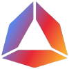

# 🟢 Andromeda

<figure><figcaption></figcaption></figure>

**Network:** Testnet | **Chain ID:** galileo-3 | **Version:** galileo-3-v1.1.0-beta1


Andromeda is an application platform layer that connects all public blockchains in the Cosmos ecosystem. Through our vast library of no-code smart contracts, users can harness the power of web3.


#### **Explorers** : [explorer.sxlzptprjkt.xyz/andromeda](https://explorer.sxlzptprjkt.xyz/andromeda)

#### **Public Endpoints**

* RPC : [rpc-andromeda.sxlzptprjkt.xyz](https://rpc-andromeda.sxlzptprjkt.xyz)
* API : [api-andromeda.sxlzptprjkt.xyz](https://api-andromeda.sxlzptprjkt.xyz)
* gRPC : `https://grpc-andromeda.sxlzptprjkt.xyz:443`

#### **Addrbook**
```
curl -Ls https://raw.githubusercontent.com/sxlzptprjkt/resource/master/testnet/andromeda/addrbook.json > $HOME/.andromedad/config/addrbook.json
```

#### **Genesis**
```
curl -Ls https://raw.githubusercontent.com/sxlzptprjkt/resource/master/testnet/andromeda/genesis.json > $HOME/.andromedad/config/genesis.json
```

#### **State Sync Peer**
```
8870aca1936673bb2068ed07fcadc6c46d3ec3a1@146.190.83.6:22656
```

#### **Live Peers**
```
PEERS="1d94f397352dc20be4b56e4bfd9305649cbac778@65.108.232.150:20095,a03f2662a9520e34aee6fd561a8a126795f9420d@65.109.93.58:45656,bd323d2c7ce260b831d20923d390e4a1623f32c4@213.239.215.195:20095,334a842f175c2c24c6b11e8bce39c9d3443471ae@38.242.213.79:26656,7ac17e470c16814be55aa02a1611b23a3fba3097@75.119.141.16:26656,749114faeb62649d94b8ed496efbdcd4a08b2e3e@136.243.93.134:20095,642a71c36bc4983b6ab90fce65d3ee7584b7a86c@88.99.161.162:47656,2659bfc2e13709467f5e231f82409586ee32e541@65.108.197.169:15656,e95899eb682e517d74449dd575073daf1a3266d5@135.181.208.169:27656,247f3c2bed475978af238d97be68226c1f084180@88.99.164.158:4376"
sed -i -e "s|^persistent_peers *=.*|persistent_peers = \"$PEERS\"|" $HOME/.andromedad/config/config.toml
```
